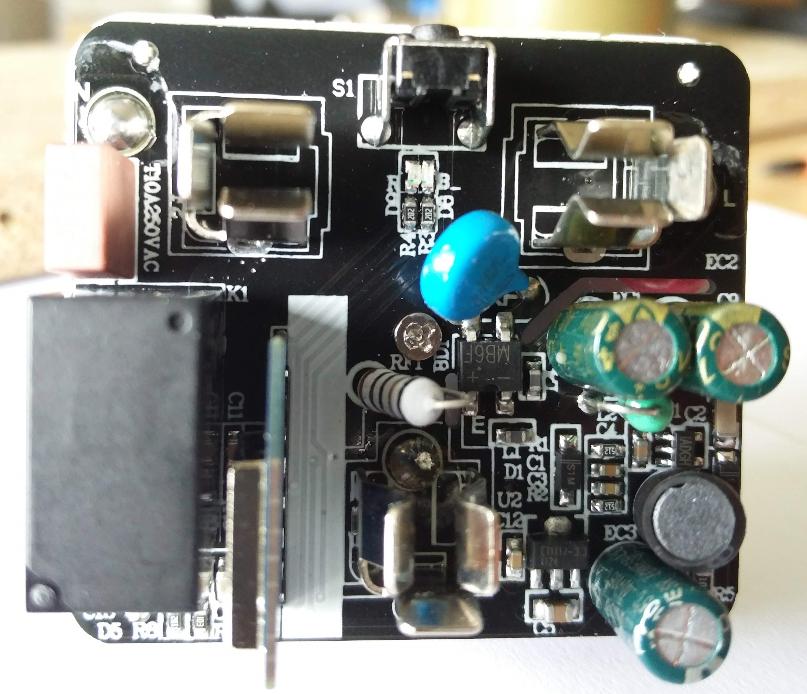
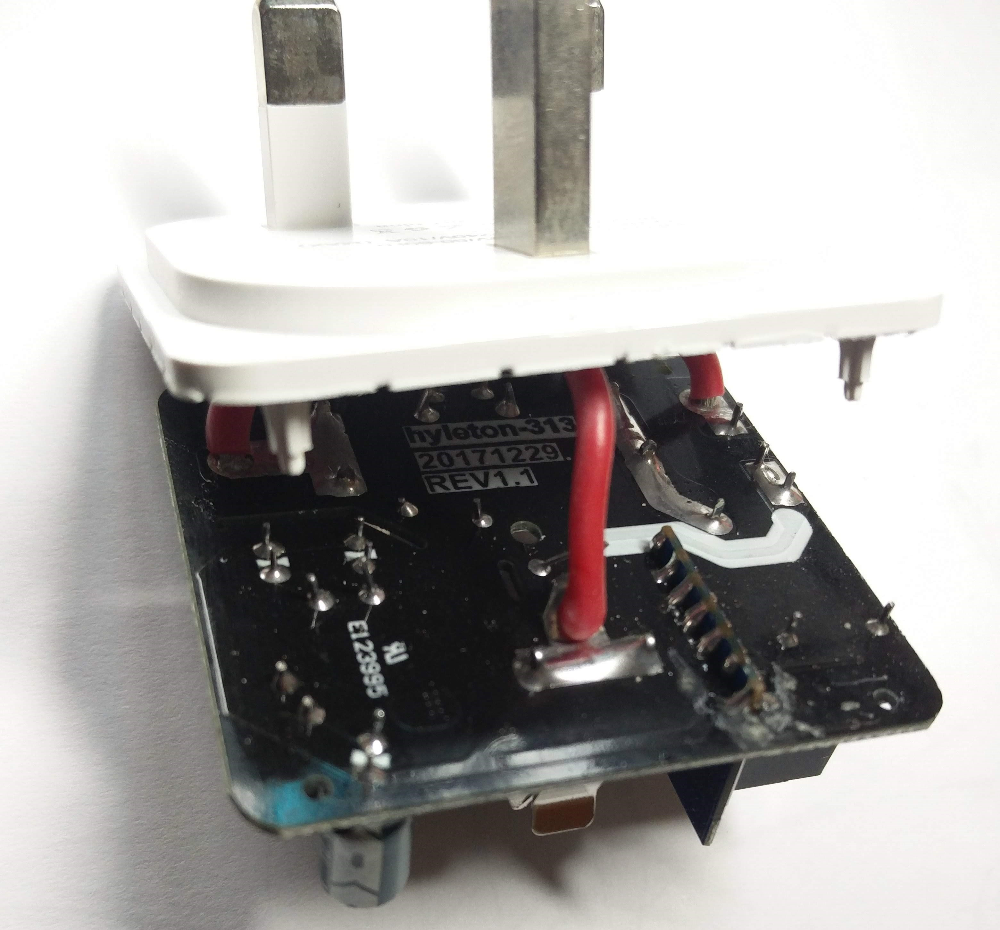
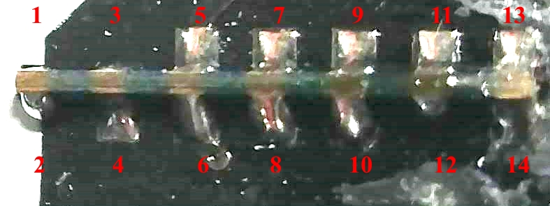
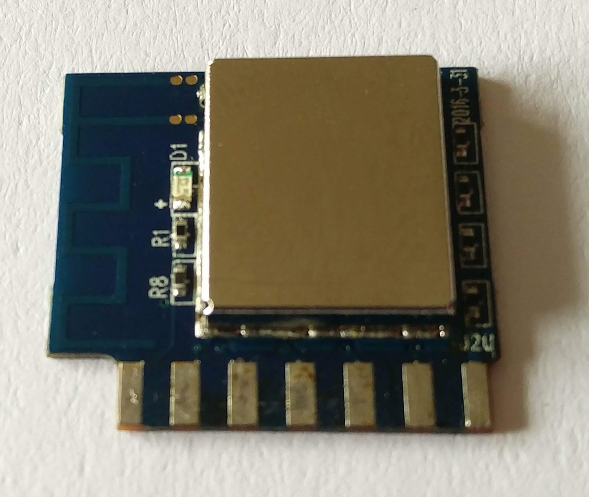
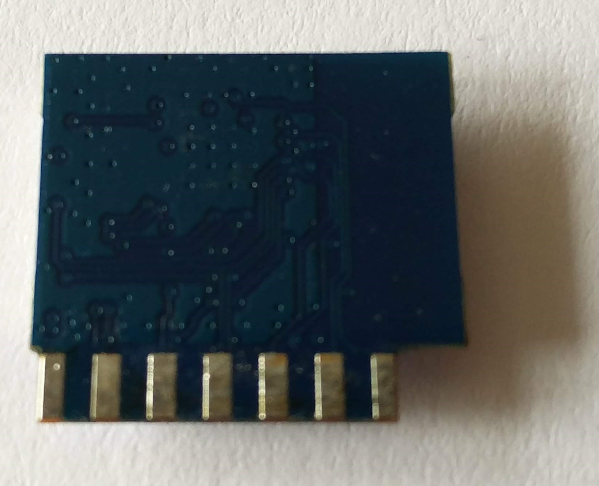
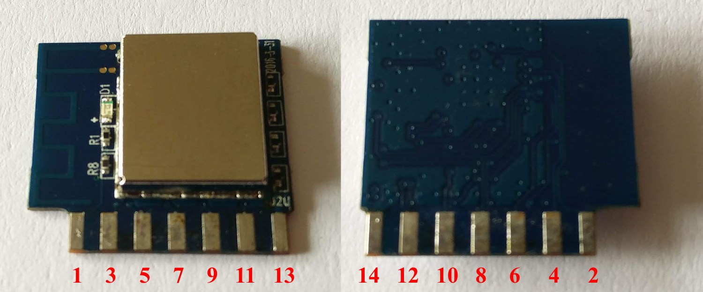
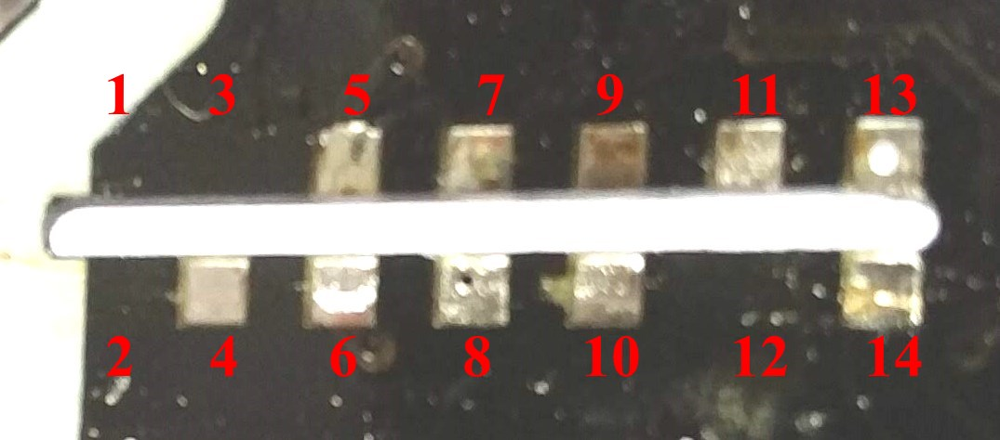

## Open the case
Opening the case didn't look as easy as it was with other (i.e. Sonoff) devices, because there were no visible screws. However it was not that difficult using some sharp plastic pry tool and a heat gun (hair dryer on max setting could probably also work, but I had my heat gun ready). The pry tools I used look like these:
 But anything similar will do the trick, just work your way slowly, pry from the middle of each side. Then slowly slide the tool towards the corners and the case will ease enough eventually - open it with a gentle pull. 

Once the case is open, the top side of the PCB will be exposed:



The WiFi module is soldered vertically to the main PCB and sits right next to the relay. In order to get access to its pins, I had to first remove the screw from the centre of the PCB. After that the bottom plastic plate, which holds the three mains connector prongs, could be moved a bit to the side without desoldering anything (it is attached with short cables to the PCB, but cables' length was just enough to move it out of the way of the WiFi module's pins).

Here's a view of the bottom side of the PCB:



You can see the product labels (product code, date and board revision), as well as the UL number. But what I was really interested in were the pins of the WiFi module.

## Identify WiFi module
This was the first time I encountered this kind of WiFi module. It looked quite similar to the one I had already seen in another smart plug: [TYWE2S](https://docs.tuya.com/en/hardware/WiFi-module/wifi-e2s-module.html). However, the new module didn't have any labels on its bottom side (facing away from the relay). Unfortunately I couldn't glimpse what (if anything) was written on the front side of the module, because it was soldered quite close to the relay. So having no clue what kind of module I had, I started tracing the power pins - the 3.3V output from the LDO regulator and GND. I quickly found that the two rightmost pins of the WiFi module were in fact the power pins. I applied 3.3V and GND to those pins from an external power supply and bingo - the blue LED started to blink! I even registered the module in the "*Smart Life*" App while it was powered through the low voltage power supply.
Then I had to find the serial (*Tx*/*Rx*) pins and of course *GPIO0*. Finding *Tx* pin was easy - it occurred to be the pin next to the GND pin. When I applied power to the WiFi module, the following debug messages appeared on the terminal (baud rate set at 74880):

```
ets Jan  8 2013,rst cause:1, boot mode:(3,7)

load 0x40100000, len 1396, room 16
tail 4
chksum 0x89
load 0x3ffe8000, len 776, room 4
tail 4
chksum 0xe8
load 0x3ffe8308, len 540, room 4
tail 8
chksum 0xc0
csum 0xc0

2nd boot version : 1.4(b1)
  SPI Speed      : 40MHz
  SPI Mode       : QIO
  SPI Flash Size & Map: 8Mbit(512KB+512KB)
jump to run user1 @ 1000

OS SDK ver: 1.4.2(23fbe10) compiled @ Sep 22 2016 13:09:03
phy v[notice]device.c:784 fireware info name:esp_yuan_plug_America version:1.0.0
[notice]device.c:785 fireware PID=<MyPID>
[notice]device.c:786 fireware for HAI-LONG-TONG
[notice]gw_intf.c:333 Authorization success
[notice]device.c:816 ##  AUTH DONE ##

[notice]key.c:77 rst reason:0

[notice]key.c:77 rst reason:0

mode : sta(dc:4f:22:xx:xx:xx)
add if0
scandone
state: 0 -> 2 (b0)
state: 2 -> 3 (0)
state: 3 -> 5 (10)
add 0
aid 3
pm open phy_2,type:2 0 0
cnt

connected with <MyApName>, channel 4
dhcp client start...
ip:192.168.100.220,mask:255.255.255.0,gw:192.168.100.1
[notice]mqtt_client.c:610 mqtt connect success

```

*PID*, *MAC* and my *AP* name are censored above, everything else is left as it was.

Some interesting findings from the messages above:

- The firmware (or *fireware* as it is incorrectly spelled) seems to be made for a company called [HAI-LONG-TONG](http://usb-wall-charger.sell.everychina.com/aboutus.html), which owns the brand HYLETON (these two sound quite similar!)
- The SPI flash chip size is 8Mbit (1MB)

Surely no information about pins assignment could be seen in the debug messages, so it was time to move onto identifying those pins.

## Identify pins
Having already identified three of the most important pins (Vdd, GND and Tx), I thought that my task was almost over. I just needed to find the positions of Rx and GPIO0. But my curiosity was strong at that moment and I started to look for the control signals first. Here is a close-up view of the module's pins as seen from the bottom of the main PCB:


As seen in the picture above, pins 1,2,3 and 12 have no corresponding pads on the main PCB (i.e. they are not connected). Probing the other pins I found the connection to the button - when pressed, it connects GND to pin 5. This in turn switched the relay on, as well as the red LED. Probing around I found that when the relay is switched on, the signal on pin 6 goes high (it stays low when the relay is switched off). Soon I also found that the red LED is switched on when the signal on pin 7 goes low, and blue LED is switched on when the signal on pin 8 goes low (both pins are normally high). Using the pin numbering scheme above, *Vdd* was on pin 13, *GND* - on pin 14, and *Tx* - on pin 12. So my assumption was that *Rx* and *GPIO0* could be routed to some of the remaining pins - 4, 9, 10 or 11. I also assumed that *Rx* pin could be routed in close proximity to the *Tx* pin (on other similar modules *Rx* and *Tx* are usually routed next to each other). So I just soldered a jumper wire to pin 10, hoping that it was indeed the *Rx* pin I was looking for. Then I needed to just connect the pin corresponding to *GPIO0* (unknown to me at the time) to ground while applying power to the module, in order to bring its bootloader into UART firmware upload mode. Unfortunately this exercise didn't work out as planned, so I resorted to the desoldering braid. After removing all the solder from the module's pads, I just pulled the module out of the slot of the main PCB. I hoped to find some identification at the front, so I could lookup the pinout:

Nothing! Only components' labels, but no manufacturer or model identification whatsoever. Here is a photo of the back of the module as well, just for completeness:

So I had no other choice but to grab the heat gun and remove the metal shielding cap. Unfortunately, I forgot to take a photo of the module with the metal cap taken off, but it looked pretty standard inside - the ESP8266EX chip with a SPI flash chip next to it, a 26MHz crystal and a bunch of passive components. Surely what interested me at the time was the routing of the ESP8266's pins, so I grabbed the multimeter and soon I had the following table:

|Module pin	|ESP8266 pin|Pin name		|| Pin name		|ESP8266 pin|Module pin|
|:---------:|:---------:|-------------|---|------------|:---------:|:--------:|
|**1**		|*?*		|*?*			||*?*			|*?*		|**2**		|
|**3**		|9			|MTMS / GPIO14	||MTDI / GPIO12	|10			|**4**		|
|**5**		|12			|MTCK / GPIO13	||MTDO / GPIO15	|13			|**6**		|
|**7**		|15			|GPIO0			||GPIO2			|14			|**8**		|
|**9**		|16			|GPIO4			||GPIO5			|24			|**10**		|
|**11**		|25			|U0RXD			||U0TXD			|26			|**12**		|
|**13**		|*Vdd*		|- 				||-				|*GND*		|**14**		|

ESP pin number to pin name/function I got from [here](https://github.com/esp8266/esp8266-wiki/wiki/Pin-definition).

In fact I didn't bother tracing pins 13 and 14 (*Vdd* and *GND*), also I couldn't find where pins 1 and 2 were routed on the ESP chip, but I really didn't care, because the latter even didn't have connecting pads on the main PCB. But finally I had determined the position of the *Rx* pin (11 - U0RXD), as well as the much needed *GPIO0* (pin 7). Doh! I might have missed GPIO0 when probing before I desoldered the module - probably just skipping it, knowing that it was configured as output (driving the red LED).

This is how module pins numbers are mapped:


And this is a close-up of the slot for the module on the main PCB, with the module desoldered and pins (module's) numbered:

It is now clearly visible that module's pins 1, 2, 3 and 12 are not connected to the main PCB.

## Dump original firmware
Knowing where *Tx*, *Rx* and *GPIO0* were, I soldered 4 jumper wires to pins 11, 12, 13 and 14 - all connected to a USB-to-serial adapter. Shorting pin 7 (GPIO0) to ground while plugging the serial adapter into the computer's USB port immediately brought the module into UART firmware upload mode. It was time to dump the original firmware image! I do this with all ESP8266 modules / devices I have - first out of curiosity, and second - should I decide to return the device in its original state. The tool I used was the Python-based utility [esptool](https://github.com/espressif/esptool):

```
esptool.py --port COM5 read_flash 0x0 0x100000 hyleton-313-1M.bin
```

When the above command execution completed, original firmware was saved in file *hyleton-313-1M.bin*. A quick glimpse with a HEX editor showed what I already suspected - the firmware was based on [Tuya's Smart Cloud Platform](https://docs.tuya.com/en/cloudapi/index.html), which is referenced in the firmware via numerous endpoint strings like `http://a.gw.tuyaeu.com/gw.json` and `http://a.gw.tuyaus.com/gw.json` ([Tuya Cloud Api endpoints](https://docs.tuya.com/en/cloudapi/cloud_access.html#call-the-entry)).

## Upload custom firmware

## Configuration
