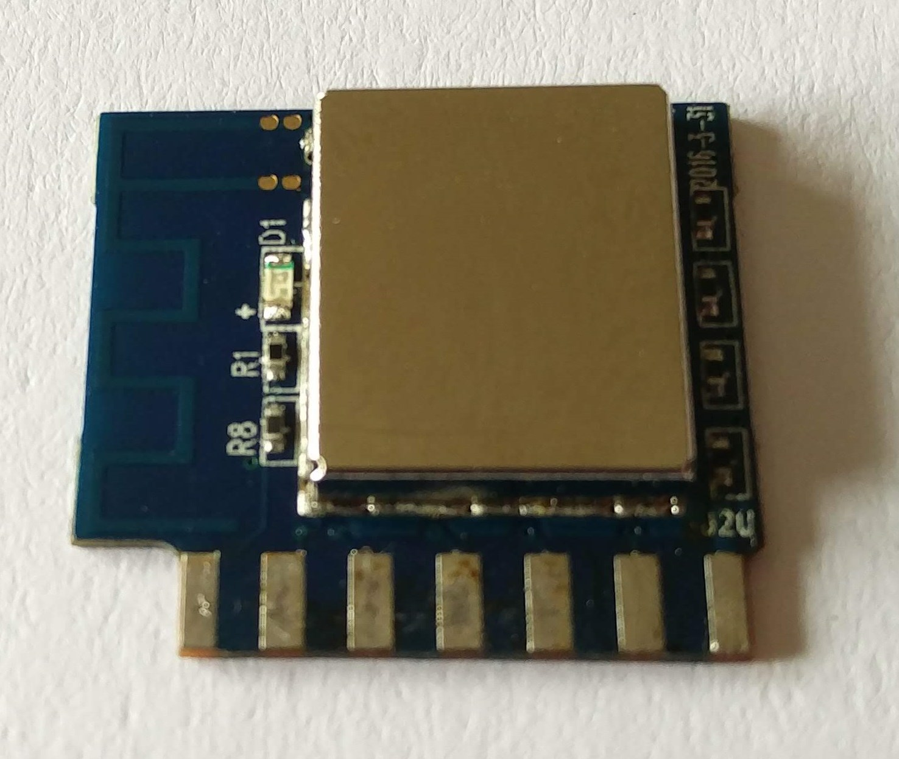

## Introduction
In my previous post about an [ESP8266-based Smart Plug](/Hyleton-313-Smart-Plug "Hyleton-313 Smart Plug"), I described how I had to desolder and remove the metal shielding cap of the WiFi module in order to identify its pins and their functions. I hadn't a clue what that module was, because there were no manufacturer, nor model labels on it.

This week I stumbled on a number of GitHub issues, containing information about other Smart devices, seemingly incorporating the same module.

## Hidden in plain sight
Buried in a Tasmota's [*wiki*](https://github.com/arendst/Sonoff-Tasmota/wiki) page was the following hidden gem:

### [SmartHome](https://github.com/arendst/Sonoff-Tasmota/wiki/SmartHome "SmartHome device")

Look carefully at the first image on that page:

Now look at my photo of [Hyleton-313](/Hyleton-313-Smart-Plug "Hyleton-313 Smart Plug")'s module front side:

That's right! It's exactly the same module, even it is the same hardware revision (2016-3-31).

So let's follow along issue [#1474](https://github.com/arendst/Sonoff-Tasmota/issues/1474), said to contain more details. User *Kiwifranky*'s [comment](https://github.com/arendst/Sonoff-Tasmota/issues/1474#issuecomment-358475920) directly gives us a pinout:

Although the pins numbering schemes are different, pins functions seem to match those in the table in section [Identify pins](/Hyleton-313-Smart-Plug/#identify-pins).

Another device using the same module, also in the same [section](https://github.com/arendst/Sonoff-Tasmota/wiki/Other-Devices) of Tasmota's wiki:

### [PowStro](https://github.com/arendst/Sonoff-Tasmota/wiki/PowStro)

This image shows the WiFi module with the metal shielding cap removed:

Same layout, even same hardware revision.

Following along the issue mentioned ([#1419](https://github.com/arendst/Sonoff-Tasmota/issues/1419)) reveals the following treasures:

[FCC ID 2AKBPESP8266-S3](https://fccid.io/2AKBPESP8266-S3) - FCC

[ESP8266-S3 WiFi Module Datasheet](https://fccid.io/2AKBPESP8266-S3/User-Manual/User-Manual-3594791.pdf)

So, now we know the manufacturer's name - **Shenzhen Hysiry Technology Co. Ltd.**, and the product name of the module appears to be **ESP8266-S3**.

## Module (un)known
Finally we have a product code for the unlabelled WiFi module - **ESP8266-S3**! And also knowing the manufacturer name leads us straight to its website:

[http://en.hysiry.com/](http://en.hysiry.com/)

Let's check what they say on the [About Us](http://en.hysiry.com/about.aspx?TypeId=1&FId=t1:1:1) page:

> Shenzhen HYSIRY Technology Co., Ltd is a High-tech enterprise specializing in the development of internet of things and intelligent electrical hardware and software. The company was established in 2015 and is a hardware partner for Tuya smart, Hekr Cloud and other Companies. The company provided product support services for Orvibo, Midea, and YITOA. The main products are: Smart Plug, Smart lighting, Smart Switch, etc.

Interesting! It appears that Hysiry are a hardware partner for [Tuya Smart](https://en.tuya.com/). That's the reason why the WiFi module in *Hyleton-313* has [firmware](/Hyleton-313-Smart-Plug/#dump-original-firmware) developed by Tuya.

Choosing *WiFi module* from the *Products* menu loads an information page about three WiFi modules: [ESP8266-1](http://en.hysiry.com/prod_view.aspx?TypeId=10&Id=167&FId=t3:10:3), [ESP8266-2](http://en.hysiry.com/prod_view.aspx?TypeId=10&Id=168&FId=t3:10:3) and [ESP8266-3](http://en.hysiry.com/prod_view.aspx?TypeId=10&Id=169&FId=t3:10:3). But most importantly, we have first-hand information for the previously unknown module: **ESP8266-S3**.

## ESP8266-S3 WiFi module
Even though the [datasheet](http://en.hysiry.com/prod_view.aspx?TypeId=10&Id=169&FId=t3:10:3) for ESP8266-S3 module on Hysiry's website is in Chinese, it is not that hard to find the pin mappings and PCB layout for example. But we can of course also download the English version of this same datasheet, which is published on fccid.io: [ESP8266-S3 datasheet](https://fccid.io/2AKBPESP8266-S3/User-Manual/User-Manual-3594791.pdf). The circuit diagram at the end of the original datasheet is however missing in the English version, so having a copy of the original is not that bad after all!
 